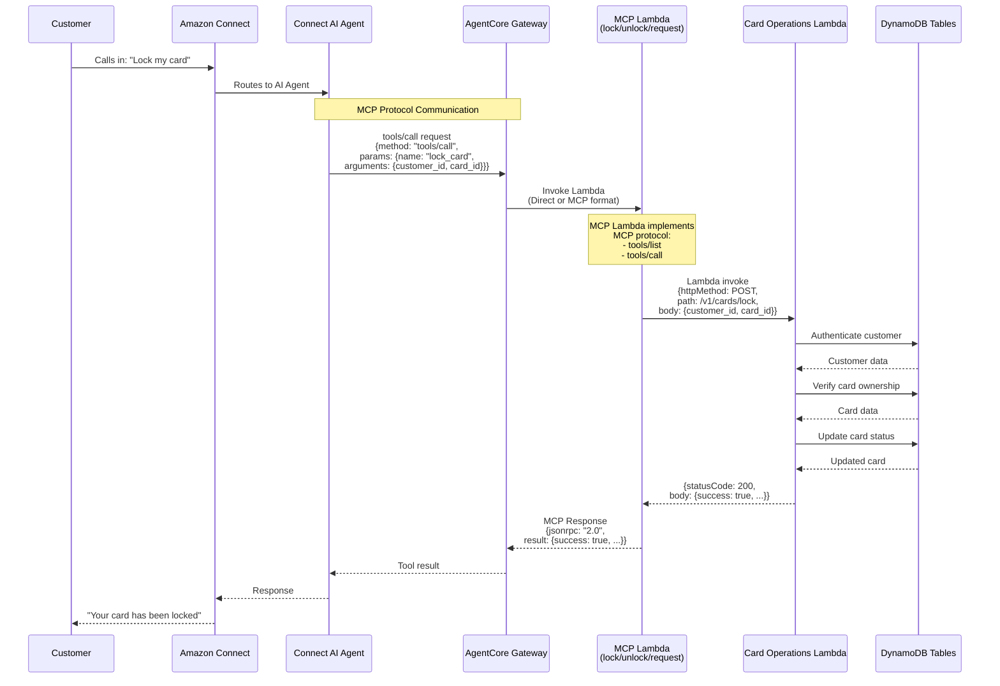

# AgentCore Gateway to Lambda Flow with MCP Protocol

## Current Architecture Flow



## MCP Protocol Implementation

### Supported Methods

Each MCP Lambda implements:

1. **tools/list** - Returns tool definition with schema
2. **tools/call** - Executes the tool with provided arguments

### Request Formats

#### MCP Protocol (Standard)
```json
{
  "method": "tools/call",
  "params": {
    "name": "lock_card",
    "arguments": {
      "customer_id": "CUST001",
      "card_id": "CARD001"
    }
  },
  "id": 1
}
```

#### Direct Invocation (Fallback)
```json
{
  "customer_id": "CUST001",
  "card_id": "CARD001"
}
```

### Response Format

#### MCP Protocol Response
```json
{
  "jsonrpc": "2.0",
  "result": {
    "success": true,
    "message": "Card successfully locked",
    "card": {
      "card_id": "CARD001",
      "status": "locked",
      "last_four": "1234"
    }
  },
  "id": 1
}
```

## Lambda Routing

Each MCP Lambda routes to Card Operations Lambda:

| MCP Lambda | Tool Name | Card Ops Path |
|------------|-----------|---------------|
| betterbank-mcp-lock-card-dev | lock_card | /v1/cards/lock |
| betterbank-mcp-unlock-card-dev | unlock_card | /v1/cards/unlock |
| betterbank-mcp-request-new-card-dev | request_new_card | /v1/cards/request-new |

## Key Benefits

1. **Standards Compliant** - Implements MCP protocol specification
2. **Tool Discovery** - AI can query available tools via `tools/list`
3. **Backward Compatible** - Still supports direct invocation
4. **Error Handling** - Structured MCP error responses
5. **Validation** - Tool name and argument validation

## Next Steps

1. Deploy updated stack: `./scripts/deploy_stack.bat dev`
2. Test MCP protocol: See [MCP_LAMBDA_UPDATE.md](MCP_LAMBDA_UPDATE.md)
3. Configure AgentCore Gateway to use MCP format
