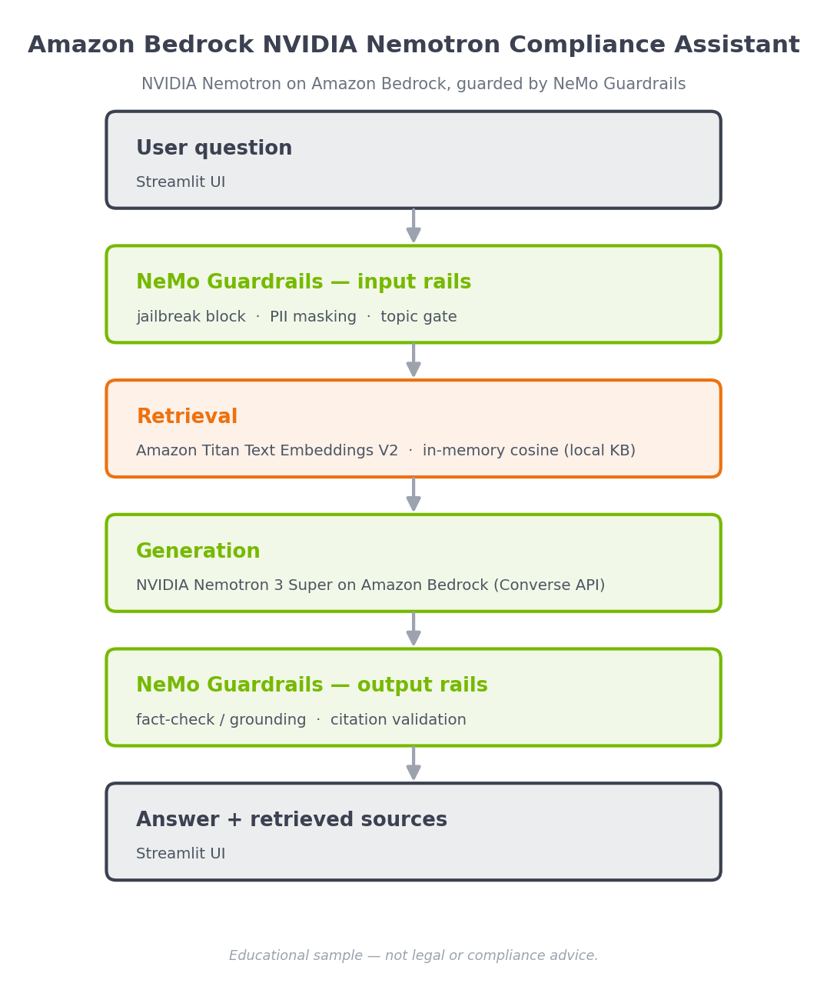

# Amazon Bedrock NVIDIA Nemotron POC

This is sample code demonstrating a financial regulatory **compliance assistant
built on the NVIDIA stack in Amazon Bedrock**: text generation uses **NVIDIA
Nemotron 3 Super** (a fully managed serverless model on Amazon Bedrock) and
safety is enforced by **NVIDIA NeMo Guardrails**, with Amazon Titan Text
Embeddings V2 for retrieval. The application has a Streamlit frontend where users
ask questions about SEC, FINRA, OCC, FinCEN, and CFPB rules and receive grounded,
citation-backed answers. NeMo Guardrails blocks jailbreak attempts, masks PII,
keeps the assistant on-topic, fact-checks answers against retrieved context, and
requires source citations.

> **Disclaimer:** Educational sample only. It does not provide legal, financial,
> or compliance advice, and model outputs may be inaccurate. Review all samples
> before using in production.

## Architecture




```
User question
   │
   ▼
NeMo Guardrails — input rails ──►  jailbreak block  +  PII masking  +  topic gate
   │
   ▼
Retrieval  ──►  Amazon Titan Text Embeddings V2  +  in-memory cosine search
   │              (over a local regulatory knowledge base)
   ▼
Generation ──►  NVIDIA Nemotron 3 Super on Amazon Bedrock (Converse API)
   │
   ▼
NeMo Guardrails — output rails ──►  fact-check / grounding  +  citation validation
   │
   ▼
Answer + retrieved sources (Streamlit UI)
```

## How it works

NeMo Guardrails (config in `nemo_guardrails/`) orchestrates the interaction. Its
Colang rails call deterministic custom actions (`nemo_guardrails/actions.py`)
that reuse the shared rail logic and the Bedrock RAG. The Bedrock chat model is
built with `langchain-aws` and passed to `LLMRails(config, llm=...)`, so it works
with NVIDIA Nemotron on Bedrock.

1. **Input rails** — block prompt-injection/jailbreak attempts, mask PII (SSN,
   EIN, card / routing / account numbers) before the model sees the message, and
   keep the assistant limited to regulatory-compliance questions.
2. **Retrieval** (`compliance_rag.py`) — a small local knowledge base
   (`knowledge_base.jsonl`) is embedded once with Amazon Titan Text Embeddings V2
   and cached in memory; the most relevant passages are selected by cosine
   similarity. No external vector store is required.
3. **Generation** (`compliance_rag.py`) — NVIDIA Nemotron 3 Super on Amazon
   Bedrock (via the Converse API) answers using only the retrieved context and is
   instructed to cite sources with `[SOURCE: citation]`. It runs from the
   `rag_answer` action inside an output rail, so the fact-check and citation
   rails verify the grounded answer.
4. **Output rails** — a grounding/fact-check rail flags claims not supported by
   the retrieved context, and a citation rail ensures a source is cited (adding a
   disclaimer if not).

Verified behavior (Amazon Bedrock, NVIDIA Nemotron 3 Super): on-topic questions
return a grounded, cited answer with sources; off-topic and jailbreak inputs are
refused by the input rails; PII in the input is masked before generation.

> **Resilience:** if NeMo Guardrails cannot initialize (dependency missing or
> model access not yet granted), the app automatically falls back to the
> equivalent rails implemented in `guardrails.py`, so it always runs. The active
> engine is shown in the app sidebar.

> This POC is a slimmed-down, Bedrock-only variant of a larger reference project
> that also covers NeMo Curator data pipelines, Nemotron fine-tuning
> (pre-training / SFT / RL), and NIM/SageMaker serving.

## Prerequisites

- Amazon Bedrock access with the following models enabled in your region:
  - `amazon.titan-embed-text-v2:0` (embeddings)
  - **NVIDIA Nemotron 3 Super** (`nvidia.nemotron-super-3-120b`) for generation —
    confirm the exact model ID in the Bedrock console for your region. If
    Nemotron access is not yet enabled, override with `BEDROCK_MODEL_ID` (e.g.
    `anthropic.claude-3-haiku-20240307-v1:0`).
- Python 3.10+
- AWS CLI configured with credentials that can call Amazon Bedrock

## Setup

```bash
# From this POC directory
python -m venv .venv
source .venv/bin/activate          # Windows: .venv\Scripts\activate
pip install -r requirements.txt
```

## Configuration (optional)

| Variable | Purpose | Default |
|----------|---------|---------|
| `AWS_REGION` | Bedrock region | `us-east-1` |
| `BEDROCK_MODEL_ID` | Text generation model | `nvidia.nemotron-super-3-120b` |
| `BEDROCK_EMBED_MODEL_ID` | Embedding model | `amazon.titan-embed-text-v2:0` |
| `RAG_TOP_K` | Passages retrieved per query | `4` |

## Usage

```bash
streamlit run app.py
```

Then open the URL Streamlit prints (default http://localhost:8501) and ask a
compliance question, for example:

- "What is the CTR filing threshold under the BSA?"
- "When must a Suspicious Activity Report be filed?"
- "What are the capital adequacy requirements for national banks?"

See [HOWTO.md](HOWTO.md) for step-by-step setup, model-access, and cleanup
instructions.

## Files

| File | Description |
|------|-------------|
| `app.py` | Streamlit frontend (UI only) |
| `compliance_guardrails.py` | Guardrail engine: NeMo Guardrails with a Python fallback |
| `nemo_guardrails/` | NeMo Guardrails config: `config.yml`, `rails.co`, `actions.py` |
| `compliance_rag.py` | Bedrock embeddings + retrieval + Converse generation |
| `guardrails.py` | Rail logic (shared with NeMo actions; used as fallback) |
| `knowledge_base.jsonl` | Local regulatory knowledge base |
| `tests/` | Unit tests (`pytest`) |
| `requirements.txt` | Python dependencies |
| `HOWTO.md` | Step-by-step instructions |

## Security

This sample runs locally and calls only Amazon Bedrock. It stores no data and
opens no network listeners other than the local Streamlit server. Review and add
appropriate authentication before exposing the app beyond local use.

## License

This library is licensed under the MIT-0 License.
